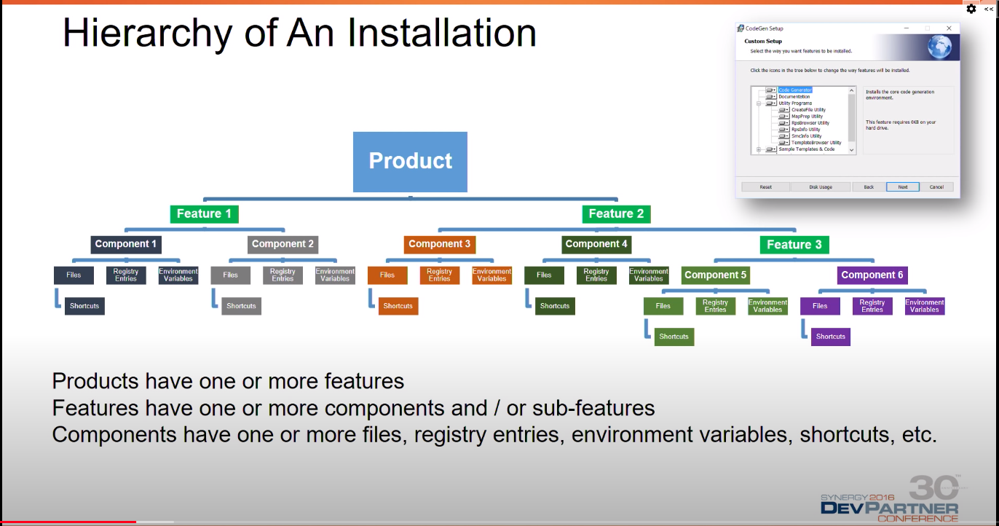

### Wix



```
<Fragment>
    <Directory Id="ProgramMenuFolder">
        <Directory Id="ApplicationProgramsFolder" Name="!(bind.property.ProductName)" />
    </Directory>
</Fragment>

<!-- Provide start menu shortcut to launch application -->
<Component Id="ApplicationShortcuts" Guid="GUID HERE" Directory="ApplicationProgramsFolder">
    <Shortcut
        Id="ApplicationShortcut" Name="!(bind.property.ProductName)" WorkingDirectory="MAINFOLDER"
        Description="Start !(bind.property.ProductName)" 
        Target="[#$(var.SampleApp.TargetFileName)]"/>
    <RegistryValue
        Root="HKCU" Key="Software\!(bind.property.Manufacturer)\!(bind.property.ProductName)"
        Name="ApplicationShortcutsInstalled" Type="integer" Value="1" KeyPath="yes"/>
    <RemoveFolder Id="ApplicationProgramsFolder" On="uninstall"/>
</Component>

<!-- Other ways to create shortcuts -->
        <Shortcut Id="startmenuFoobar10" Directory="ProgramMenuDir" Name="Foobar 1.0"
            WorkingDirectory='INSTALLDIR' Icon="Foobar10.exe" IconIndex="0" Advertise="yes" />
        <Shortcut Id="desktopFoobar10" Directory="DesktopFolder" Name="Foobar 1.0"
            WorkingDirectory='INSTALLDIR' Icon="Foobar10.exe" IconIndex="0" Advertise="yes" />
    </File>
</Component>

```
```
<!-- Registry Creation -->
<Component Id="Registry_Version" Directory="INSTALLDIR" Guid="GUID HERE">
    <RegistryKey Root="HKLM" Key="Software\!(bind.property.Manufacturer)\!(bind.property.ProductName)">
    <RegistryValue Type="string" Name="Version" Value="[ProductVersion]" KeyPath="yes" />
    </RegistryKey>
</Component>
```