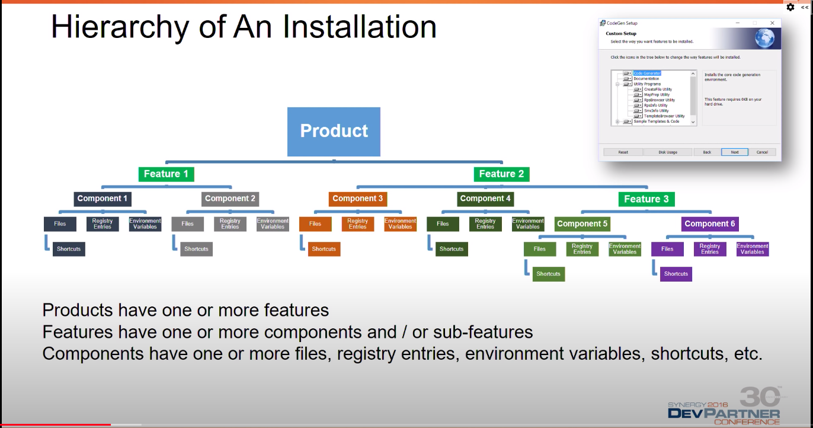

### Wix



```
<Fragment>
    <Directory Id="ProgramMenuFolder">
        <Directory Id="ApplicationProgramsFolder" Name="!(bind.property.ProductName)" />
    </Directory>
</Fragment>

<!-- Provide start menu shortcut to launch application -->
<Component Id="ApplicationShortcuts" Guid="GUID HERE" Directory="ApplicationProgramsFolder">
    <Shortcut
        Id="ApplicationShortcut" Name="!(bind.property.ProductName)" WorkingDirectory="MAINFOLDER"
        Description="Start !(bind.property.ProductName)" 
        Target="[#$(var.SampleApp.TargetFileName)]"/>
    <RegistryValue
        Root="HKCU" Key="Software\!(bind.property.Manufacturer)\!(bind.property.ProductName)"
        Name="ApplicationShortcutsInstalled" Type="integer" Value="1" KeyPath="yes"/>
    <RemoveFolder Id="ApplicationProgramsFolder" On="uninstall"/>
</Component>

<!-- Other ways to create shortcuts -->
        <Shortcut Id="startmenuFoobar10" Directory="ProgramMenuDir" Name="Foobar 1.0"
            WorkingDirectory='INSTALLDIR' Icon="Foobar10.exe" IconIndex="0" Advertise="yes" />
        <Shortcut Id="desktopFoobar10" Directory="DesktopFolder" Name="Foobar 1.0"
            WorkingDirectory='INSTALLDIR' Icon="Foobar10.exe" IconIndex="0" Advertise="yes" />
    </File>
</Component>
```
<!-- Shortcut creation example #3 -->

```
<!-- Create shortcuts -->
<Fragment>
    <ComponentGroup Id="ProductComponents">
        <ComponentRef Id="MainAppShortcut" />
    </ComponentGroup>

    <DirectoryRef Id="INSTALLFOLDER" FileSource="../Source_directory_to_exe" >
        <Component Id="MainAppShortcut" Guid="someguid">
            <Shortcut Id="MainAppShortcut"
                Name="!(loc.ProductName_$(var.Platform))"
                Target="[INSTALLFOLDER]App.exe"
                WorkingDirectory="INSTALLFOLDER"
                Icon="icon.ico"
            />
            <!-- You can just replace ProductNameFolder with ConsoleApp(your app name) -->
        <RegistryValue Id="RegShortcutKey" Root="HKCU" Key="Software\$(var.ProductNameFolder)" Name="Shortcut" Value="1" Type="integer" KeyPath="yes"/>

        <!-- Remove start menu items -->
        <RemoveFolder Id="RemoveStartMenu" Directory="InstallProgramMenuFolder" On="Uninstall" />
        </Component>
    </DirectoryRef>

</Fragment>

```


```
<!-- Registry Creation -->
<Component Id="Registry_Version" Directory="INSTALLDIR" Guid="GUID HERE">
    <RegistryKey Root="HKLM" Key="Software\!(bind.property.Manufacturer)\!(bind.property.ProductName)">
    <RegistryValue Type="string" Name="Version" Value="[ProductVersion]" KeyPath="yes" />
    </RegistryKey>
</Component>
```

```
Command for generating wxs file for directory.
heat dir "..\_bin\debug\" -gg -sfrag -template fragment -out directory.wxs

// to create with componentgroupname.
heat dir "..\_bin\debug\" -gg -sfrag -template fragment -cg PublishedComponents -var var.Ost.TargetDir -out GeneratedComponents.wxs
-var var.Ost.TargetDir | will replace SourceDir in generated output file with $(var.Ost.TargetDir)
```