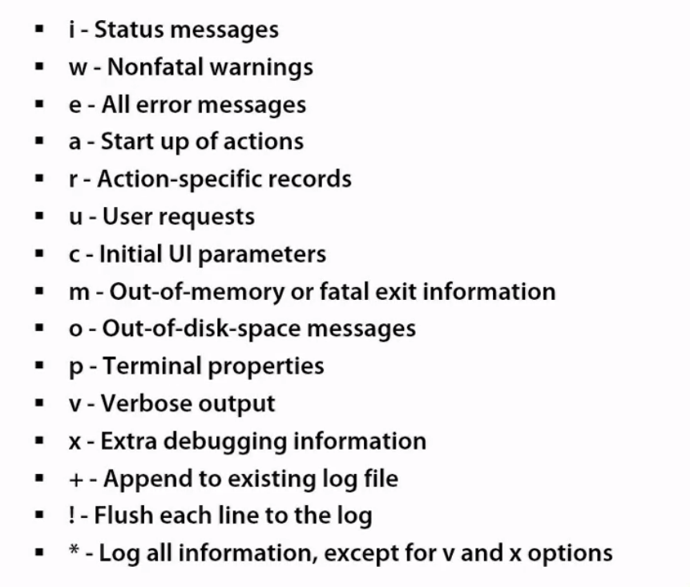
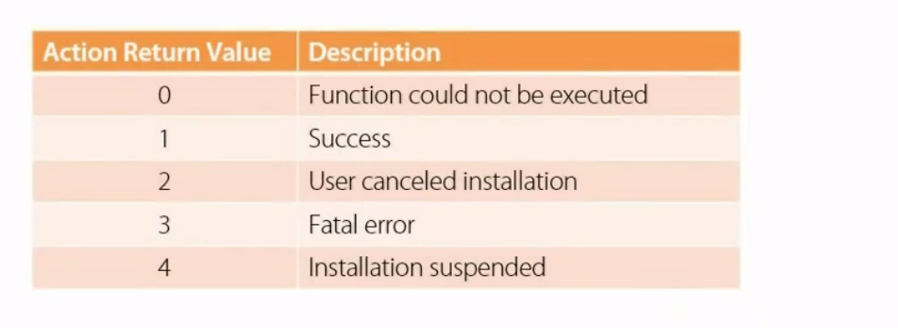

## Wix:

### Features.
- Transactional installation with rollback.
- Self Repair.
- Installer-Based UI.
- Custome Actions.
- Registration with "Programs and Features". (for uninstall or repair)
- Upgrades and Patches.
- Uninstall.
- Logging.

### Msi files utilize COM Structured Storage.


### Windows installer service takes .msi file and does the job.
```
msiexec.exe /i <file.msi>
the complement or uninstall
msiexec.exe /uninstall <file.msi | {ProductCode}>
msiexec.exe /x < file.msi | {ProductCode}>

to turn off ui
msiexec.exe /quiet /i <file.msi>

```


## Logging with msiexec.exe

```
msiexec.exe /i <file.msi> /L *vx log.txt
```



MSI Error Codes can be found at: http://bit.ly/msi-error-codes
or also at
Windows errr codes: Platform SDK - winerror.h
or
net helpmsg errorcode | for example: net helpmsg 2
--
Com error Codes:  http://bit.ly/com-error-codes
Windows installer docs: http://bit.ly/msi-installstates

If you want to see logs but use UI installer then to turn on global loggin
use: http://support.microsoft.com/kb/223300

---
### Required Properties:
- Product Code
- Product Language
- Manufacturer
- Product Version
- Product Name
Properties can be used in conditions.

- ProductCode is optional but you likely should always give it for supporting
upgrade in the future.
---
### Features:
- Contain 1 or more Components.
- Can be visible to the user in the installer UI.
- You need at least 1 feature.

### Components: Set of resources that are installed/uninstalled together.

- Contain Files
- Shortcuts
- Registry Keys
#### All Components have a GUID identifier.

Also each Component has KeyPath:
- File or registry key used to detect the component.
- Enables Windows Installer "Resiliencey" | this means if after installation this
path is deleted or currupated then the installer will try to repair the installation.
- Recomended: 1:1 mapping between files & components.
- For the installed file to be resilient, it must be the KeyPath

### Installation Types:
- Simple 
- Administrative | App's source image installed to network
- Advertisement
 - Only the interface for launching the app is installed.
 - When user "starts" app, on-demand installation occurs.
### Installation Pheses:
- UI - client side (runs with user privileges)
- Execute - server side (runs as LocalSystem)

UI/client Phase can be omitted or turned off via command line (option: /q).
There is no transaction in UI phase.

Execute/Server Phase is transactional and all the system changes must occur here.


 ### To install specific feature:
 ```
 <Feature Id="FeatureId"/>
 Msiexec.exe /i foo.msi ADDLOCAL=FeatureId
 ```
 If you want to provide UI for your installer then you need to add the title of the feature.
 <Feature Id="SpellChecker"
          Title="Spell Checking Module"
          Description="desciption text"
          Level="1" />
The default value for Level is 1 meaning that feature will be installed locally.
If Level is set to 0 then the feature will be disabled and not displayed in UI and not be installed.
Feature level works with InstallLevel the value of installlevel determines whether the 
feature will be installed by default.
Feature get's installed if Level <=  InstallLevel. But remember that 0 is special and will disable feature.
And InstallLevel is set to 1 by default.

---
Now let's assign components to the feature.
<Feture Id="ProductFeature"
    Title = "Main Feature"
    Level="1" >
    <ComponentRef Id="Component1"/>
    or we can add entire componentgroup
    <ComponentGroupRef Id="MyComponentGroup"/>
</Feature>
---
### To uninstall:
msiexec.exe /x <file.msi | {ProductCode}>


