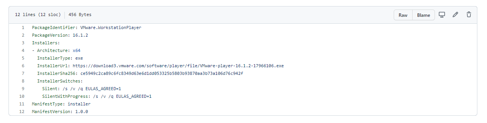
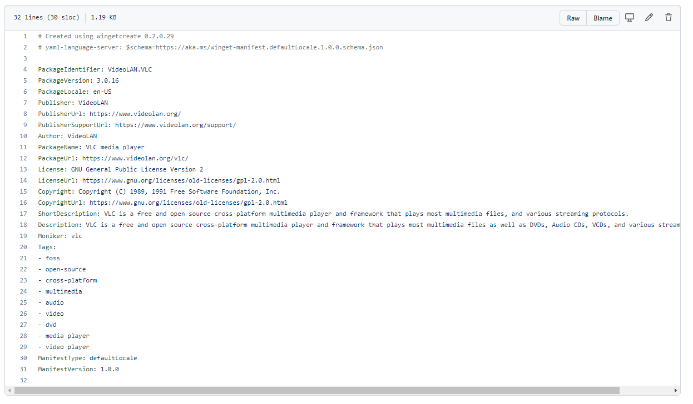
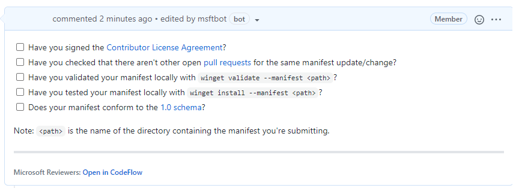

## [How to contribute to windows package manager](https://docs.microsoft.com/en-us/learn/modules/explore-windows-package-manager-tool/6-contribute-to-repository)

Steps:
- winget install microsoft.wingetcreate

- wingetcreate new
The tool will prompt you for the URL or URLs of the software package, this should be a publicly accessible URL and not something stored locally by yourself.

The tool will start to query the file and pull out some information. It will start by suggesting a package identifier, package version, default language, the architecture the package will install on (think x86, x64, etc.), publisher name, package name, package license and a description for the package. All this information helps people find and install the software.
Installer file example:
You can also create tags for the installer file

---
Next step:
- winget validate –manifest <manifest path>

- test installer on separate machine
[Windows Sandbox Environment](https://docs.microsoft.com/en-us/windows/security/threat-protection/windows-sandbox/windows-sandbox-overview)

The command you need to use is
- winget install –manifest <manifest path>.

## Submitting the manifest
[Creating a personal access token.](https://docs.github.com/github/authenticating-to-github/keeping-your-account-and-data-secure/creating-a-personal-access-token)

Once you have the token you need to store it into your command-line tool for winget to use, you do this with the command:

- wingetcreate –store <token> 

You are now ready to submit your creation to the Microsoft team for review. To do this you should issue the command:

- wingetcreate submit <path to manifest>

This will create a repository store within you GitHub profile and then create a pull request on the [Windows Package Manager repository](https://github.com/microsoft/winget-pkgs)

When that command is complete, it will open a browser session to the pull request (PR). Here you will be asked to complete a checklist.
