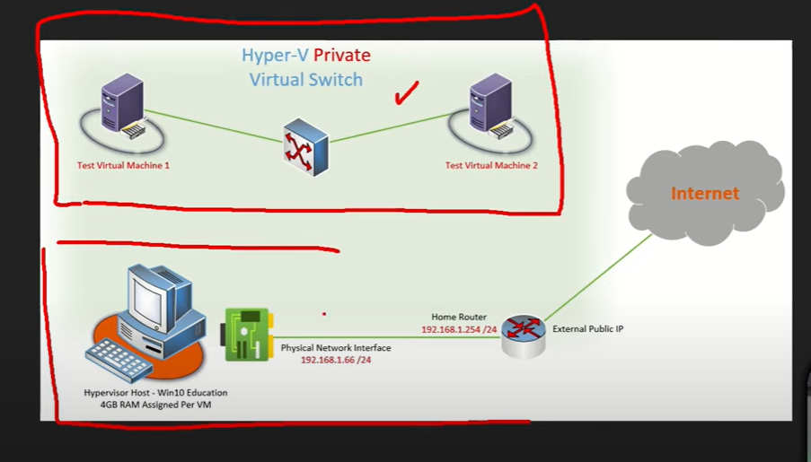
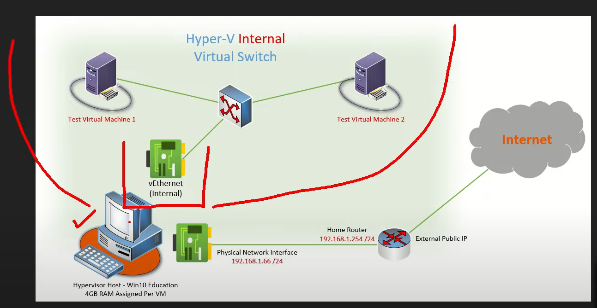
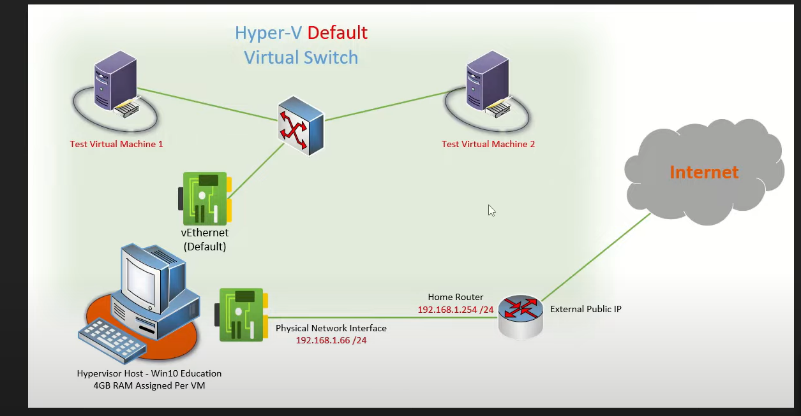

## [Managing and Configuring Hyper-V Virtual Switches -- Default, Internal, External, and Private](https://www.youtube.com/watch?v=jdk6xCNmydU)

This allows to isolate vms from local network.

With internal we can connect our host to external network.

